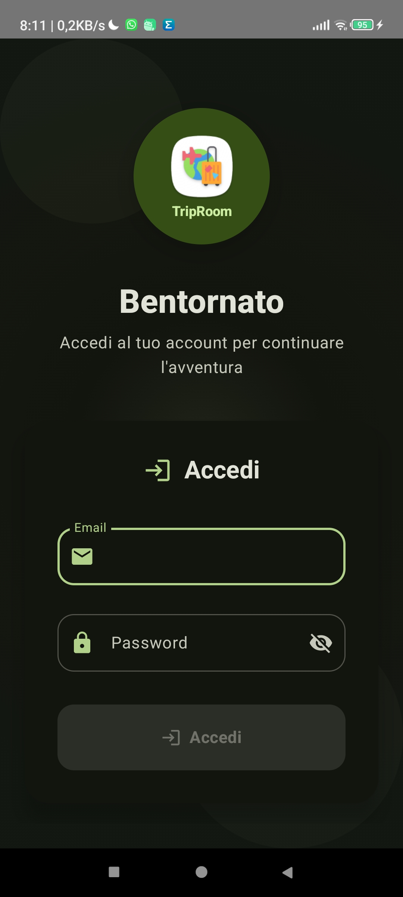
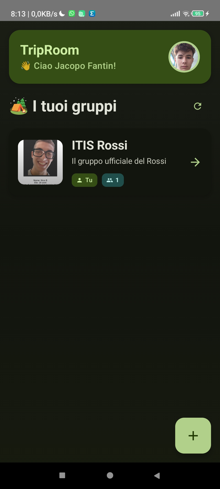
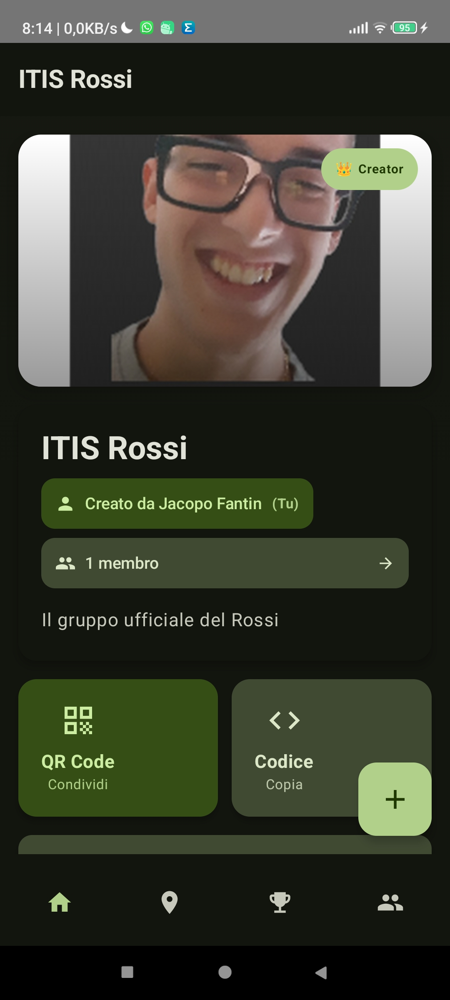
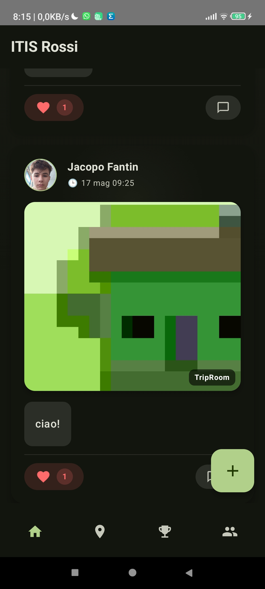
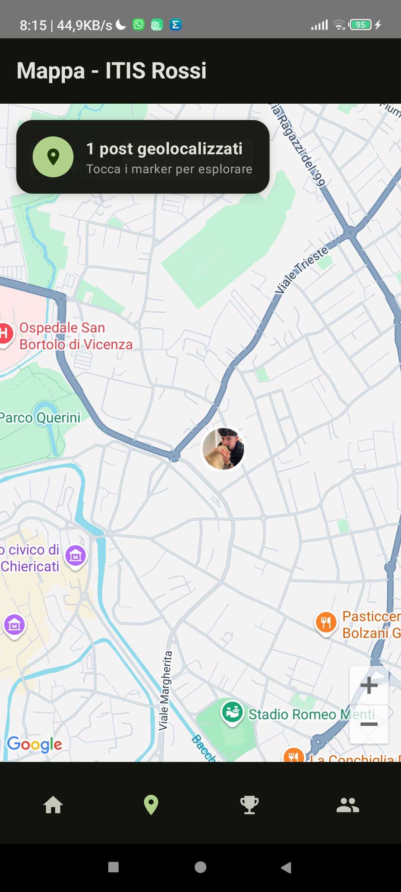
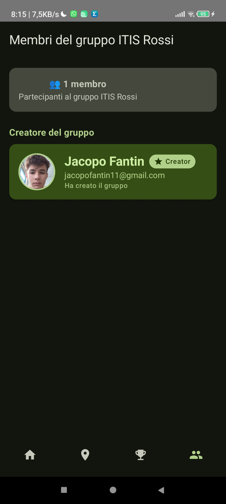
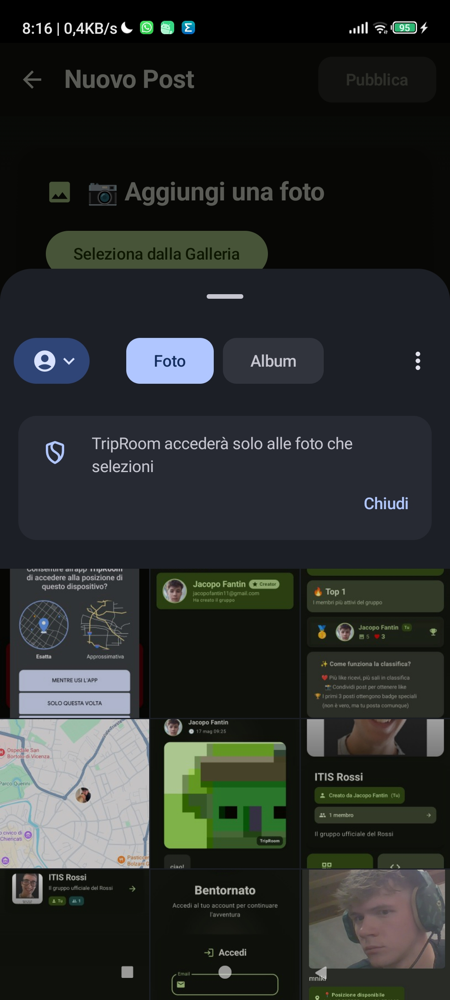
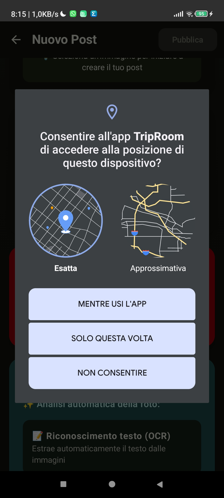

# TripTales - Frontend Android

## 📱 Descrizione del Progetto

**TripTales** è un'applicazione Android moderna per documentare e condividere i momenti salienti delle gite scolastiche in modo collaborativo. L'app utilizza tecnologie avanzate come l'intelligenza artificiale di Google ML Kit per analizzare automaticamente le foto, la geolocalizzazione per mappare i luoghi visitati, e un sistema di gamification con badge per incentivare la partecipazione.

Sviluppata con **Jetpack Compose** e architettura **MVVM**, TripTales offre un'esperienza utente fluida e intuitiva per creare, condividere e scoprire i ricordi di viaggio insieme ai compagni di classe.

## 📸 Screenshots
<table>
  <tr>
    <td align="center">
      <br>
      <b>Login</b>
    </td>
    <td align="center">
      <br>
      <b>Home</b>
    </td>
    <td align="center">
      <br>
      <b>Group Screen</b>
    </td>
    <td align="center">
      <br>
      <b>Group Posts</b>
    </td>
  </tr>
  <tr>
    <td align="center">
      <br>
      <b>Map View</b>
    </td>
    <td align="center">
      <br>
      <b>Members</b>
    </td>
    <td align="center">
      <br>
      <b>AI Analysis</b>
    </td>
    <td align="center">
      <br>
      <b>AI Progress</b>
    </td>
  </tr>
  <tr>
    <td align="center">
      <br>
      <b>Create Post</b>
    </td>
    <td align="center">
      <br>
      <b>Gallery</b>
    </td>
    <td align="center">
      <br>
      <b>Leaderboard</b>
    </td>
    <td align="center">
      <br>
      <b>Camera Permission</b>
    </td>
  </tr>
  <tr>
    <td align="center">
      <br>
      <b>Location Permission</b>
    </td>
    <td colspan="3"></td>
  </tr>
</table>


## 🏗️ Architettura MVVM

L'applicazione segue rigorosamente il pattern **Model-View-ViewModel (MVVM)** per garantire separazione delle responsabilità, testabilità e manutenibilità del codice:

### **Model**
- **Data Classes**: Rappresentano le entità (User, Group, Post, Comment, Badge)
- **Repository Pattern**: Gestisce le chiamate API e la cache locale
- **API Services**: Interfacce Retrofit per la comunicazione con il backend Django

### **View**
- **Jetpack Compose**: UI dichiarativa e moderna
- **Componenti Riutilizzabili**: Card, dialog, input field modulari
- **Navigation Component**: Gestione della navigazione tra schermate
- **Theming**: Sistema di temi Material Design 3

### **ViewModel**
- **StateFlow**: Gestione reattiva dello stato dell'UI
- **Coroutines**: Operazioni asincrone e gestione del lifecycle
- **Factory Pattern**: Creazione controllata dei ViewModel con dependency injection

### **Struttura delle Cartelle**
```
app/src/main/java/com/triptales/app/
├── data/                 # Layer Model
│   ├── auth/            # Autenticazione e token
│   ├── user/            # Gestione utenti e profili
│   ├── group/           # Gruppi e membership
│   ├── post/            # Post e like
│   ├── comment/         # Sistema commenti
│   ├── location/        # Geolocalizzazione
│   ├── mlkit/          # Integrazione ML Kit
│   ├── leaderboard/    # Classifica utenti
│   └── utils/          # Utility e helper
├── ui/                  # Layer View
│   ├── auth/           # Schermate login/registrazione
│   ├── home/           # Home e dashboard
│   ├── group/          # Gestione gruppi
│   ├───image/          # Gestione immagini
│   ├── post/           # Creazione e visualizzazione post
│   ├── profile/        # Profili utente
│   ├── components/     # Componenti riutilizzabili
│   ├───qrcode/         # Generazione e lettura QR code
│   └── theme/          # Temi e stili
└── viewmodel/          # Layer ViewModel
```

## ⚡ Funzionalità Base

### **🔐 Sistema di Autenticazione**
- Registrazione utenti con foto profilo
- Login sicuro con JWT tokens
- Gestione automatica del refresh token
- Logout e cambio account

### **👥 Gestione Gruppi**
- Creazione gruppi di gita con immagine e descrizione
- Sistema di inviti tramite QR code o codice alfanumerico
- Visualizzazione membri e ruoli (creator/membro)
- Lista dei propri gruppi con statistiche

### **📷 Condivisione Post**
- Creazione post con foto, didascalia e geolocalizzazione
- Feed cronologico dei post del gruppo
- Sistema di like e commenti
- Visualizzazione fullscreen delle immagini

### **🗺️ Mappa Interattiva**
- Visualizzazione post geolocalizzati su mappa Google Maps
- Marker personalizzati con anteprima foto
- Clustering automatico per post vicini
- Navigazione tra i luoghi visitati

### **🏆 Sistema Badge e Gamification**
- Badge automatici per milestone (primo post, primo commento, ecc.)
- Classifica like per gruppo
- Profili utente con raccolta badge
- Sistema di achievement progressivi

## 🔧 Funzionalità Aggiuntive

### **📱 Scansione QR Code**
- Scanner nativo integrato per unirsi ai gruppi
- Generazione QR code personalizzati per ogni gruppo
- Condivisione rapida dei codici gruppo
- Gestione errori e validazione codici

### **✂️ Ritaglio Immagini Avanzato**
- Editor di ritaglio integrato con gesture touch
- Rapporti d'aspetto personalizzabili
- Anteprima in tempo reale
- Compressione automatica per ottimizzare le performance

### **🤖 Integrazione ML Kit**
- **OCR (Optical Character Recognition)**: Estrazione automatica del testo dalle immagini
- **Object Detection**: Riconoscimento automatico di oggetti e luoghi
- **Smart Captions**: Suggerimenti intelligenti per le didascalie
- **Tag Automatici**: Categorizzazione automatica delle foto

### **📍 Geolocalizzazione Avanzata**
- Rilevamento automatico della posizione
- Calcolo distanze tra utenti e luoghi
- Gestione permessi location-aware
- Integrazione con Google Maps API

## 🚀 Istruzioni per l'Esecuzione

### **Prerequisiti**
- Android Studio Hedgehog (2023.1.1) o superiore
- SDK Android 24+ (Android 7.0)
- JDK 11 o superiore
- Dispositivo Android o emulatore con Google Play Services

### **1. Configurazione Google Maps API**

Per utilizzare le funzionalità di mappa, è necessario ottenere una chiave API Google Maps:

1. Vai alla [Google Cloud Console](https://console.cloud.google.com/)
2. Crea un nuovo progetto o seleziona uno esistente
3. Abilita le API:
    - Maps SDK for Android
    - Places API
    - Geocoding API
4. Vai a "Credenziali" e crea una nuova chiave API
5. Aggiungi la chiave nel file `gradle.properties` (locale):

```properties
# File: gradle.properties (nella root del progetto)
MAPS_API_KEY=your_google_maps_api_key_here
```

6. Il file `build.gradle.kts` (app level) è già configurato per leggere la chiave:

```kotlin
android {
    defaultConfig {
        manifestPlaceholders["MAPS_API_KEY"] = findProperty("MAPS_API_KEY") ?: ""
    }
}
```

### **2. Configurazione Backend**
Assicurati che il backend Django sia in esecuzione. Modifica l'URL del server nel file:
```kotlin
// File: app/src/main/java/com/triptales/app/data/RetrofitProvider.kt
private const val URL = "http://YOUR_BACKEND_IP:8000/api/"
```

### **3. Avvio dell'Applicazione**
```bash
# Clona il repository
git clone https://github.com/username/pw-frontend-triptales.git
cd pw-frontend-triptales

# Apri il progetto in Android Studio
# Sincronizza le dipendenze Gradle
# Connetti un dispositivo Android o avvia un emulatore
# Esegui l'app (Shift + F10)
```

## 📦 Creazione dell'APK

### **APK di Debug**
```bash
# Da Android Studio
Build > Build Bundle(s) / APK(s) > Build APK(s)

# Da terminale
./gradlew assembleDebug
```
L'APK sarà generato in: `app/build/outputs/apk/debug/app-debug.apk`

### **APK di Release (Firmato)**

1. **Generazione Keystore** (solo la prima volta):
```bash
keytool -genkey -v -keystore triptales-release-key.keystore -keyalg RSA -keysize 2048 -validity 10000 -alias triptales
```

2. **Configurazione nel file `keystore.properties`**:
```properties
storeFile=../triptales-release-key.keystore
storePassword=your_store_password
keyAlias=triptales
keyPassword=your_key_password
```

3. **Build Release**:
```bash
# Da Android Studio
Build > Generate Signed Bundle / APK > APK > Next > Release

# Da terminale
./gradlew assembleRelease
```

### **App Bundle (Raccomandato per Google Play)**
```bash
./gradlew bundleRelease
```
Il bundle sarà generato in: `app/build/outputs/bundle/release/app-release.aab`

## 🛠️ Tecnologie Utilizzate

- **Kotlin** - Linguaggio di programmazione principale
- **Jetpack Compose** - Toolkit UI moderno per Android
- **Material Design 3** - Sistema di design Google
- **Retrofit + OkHttp** - Client HTTP per API REST
- **Google Maps SDK** - Integrazione mappe e geolocalizzazione
- **ML Kit** - Machine Learning on-device di Google
- **CameraX** - API camera moderna di Android
- **DataStore** - Gestione preferences e cache locale
- **Navigation Component** - Navigazione tra schermate
- **Coil** - Libreria per caricamento immagini
- **QR Code Generator** - Generazione e scansione QR codes

## 📝 Note di Sviluppo

- L'applicazione è ottimizzata per Android 7.0+ (API 24)
- Utilizza le moderne API di Android per camera, location e storage
- Implementa le best practice di Material Design 3
- Gestisce automaticamente la rotazione schermo e stati dell'app
- Include logging completo per debugging e monitoraggio

---

**Sviluppato per il corso TPSIT - Quinta - Project Work Android e Django**
